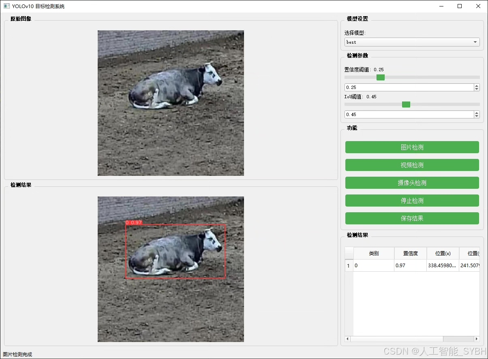
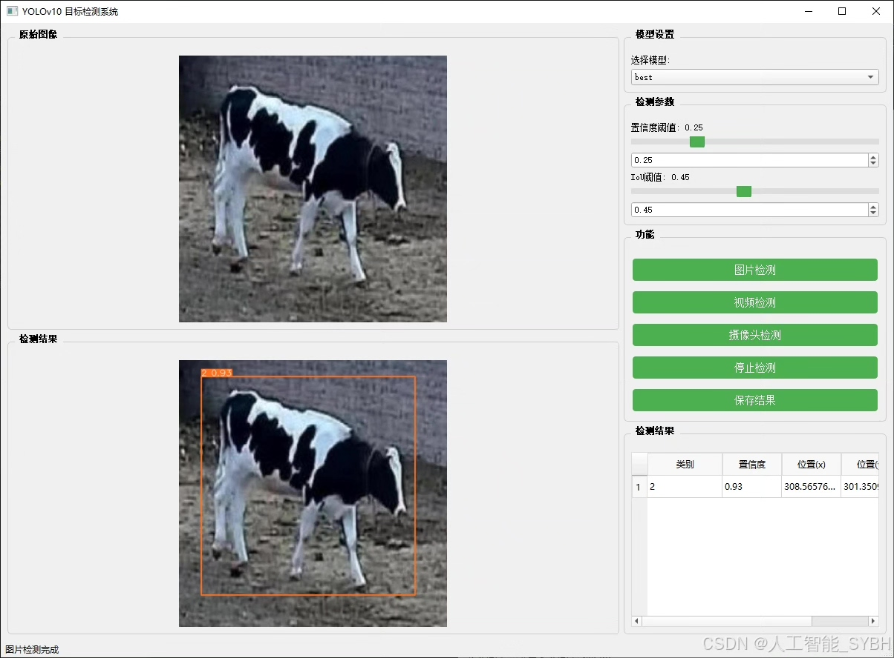
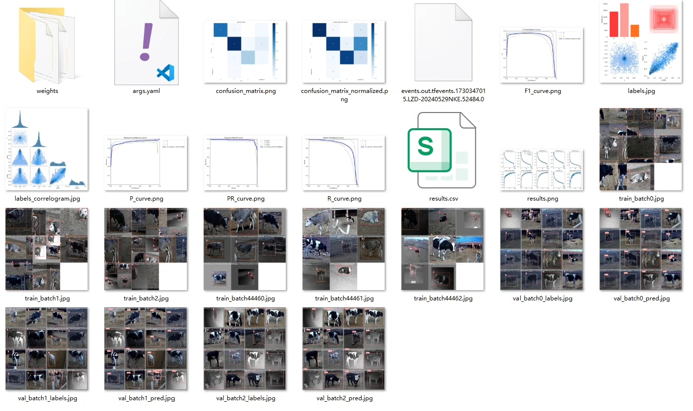
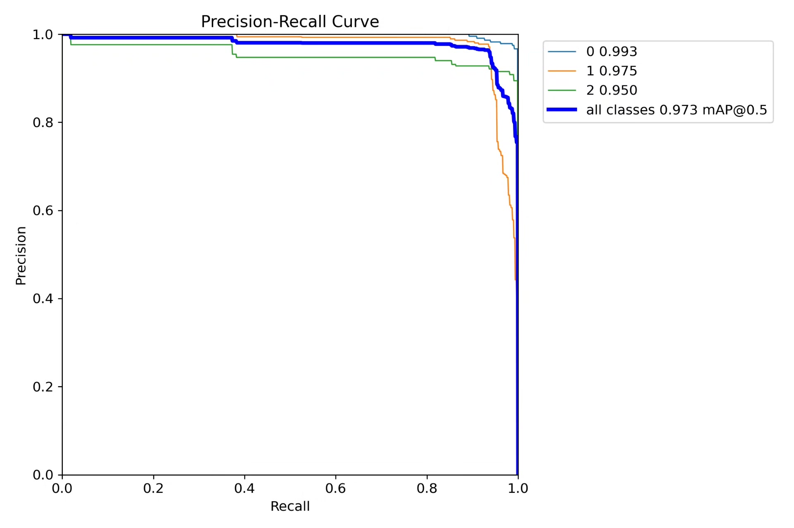
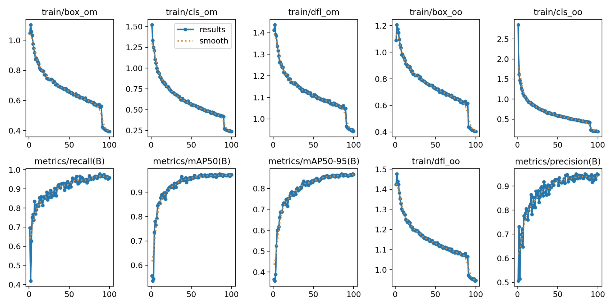
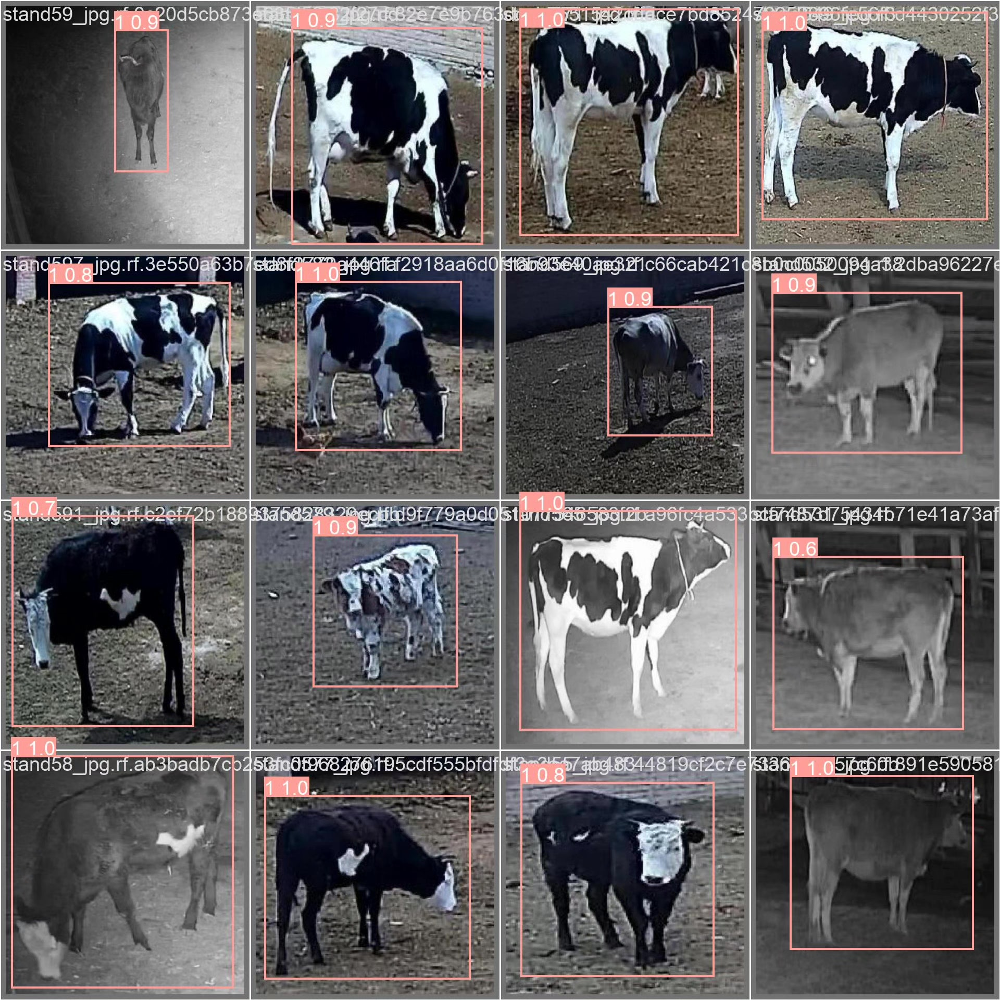
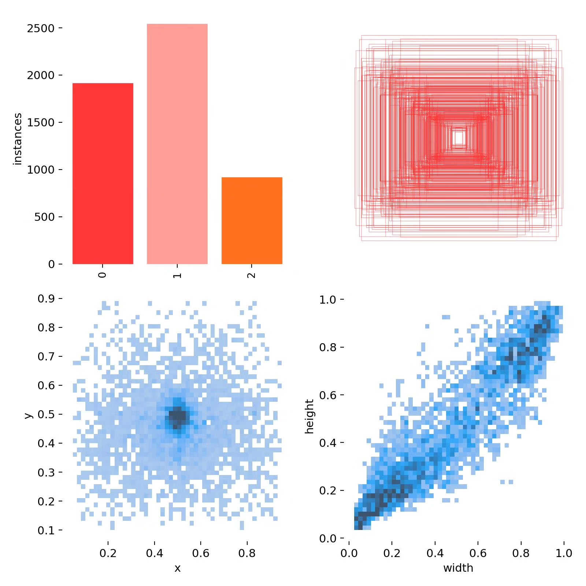
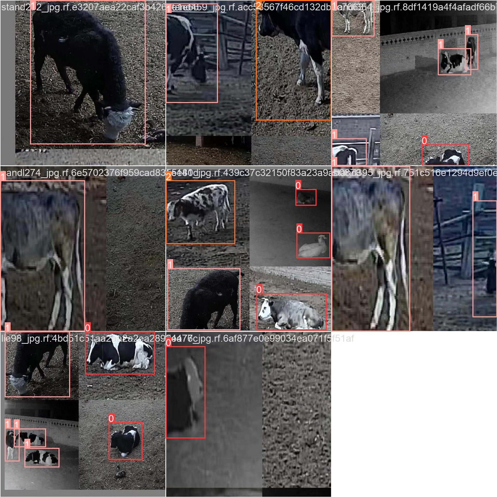

# Based on YOLOv10 deep learning for dairy cow behavior detection system

## Body

YOLOv10 Cow Behavior Detection System is a smart system based on the You Only Look Once version 10 (YOLOv10) object detection algorithm, specifically designed for detecting cow behaviors. This system can automatically identify and classify three main behaviors of cows: standing, walking, and lying down. Through this system, users can monitor the behavior status of cows in real-time, helping farm managers optimize cattle health management, improve production efficiency, and provide data support for animal welfare.

Training set: 3946 images
Validation set: 493 images
Test set: 493 images

The company's products have obtained the official commercial license certification from YOLO.

We offer after-sales service.

After payment, we will provide WeChat IDs to answer questions at any time.

Environment configuration: We will provide an environment configuration tutorial, and WeChat will provide答疑.
Remote installation service: If you need remote configuration, an additional fee of 69 is required, with all fees refunded if the configuration fails (only refund installation fees for older computers).
Retraining dataset: After configuring the environment, you can train on your own computer. If you need us to retrain, just pay 69 plus computing power fees (2.5 yuan/hour).

Full after-sales service

## Images

## Payment

Here is a pay link on Stripe ( https://buy.stripe.com/3cs8yP7sY87d0vu9AB ). Please contact me lonlonago@foxmail.com after funding $89, and I will send you a complete data files , thank you!

